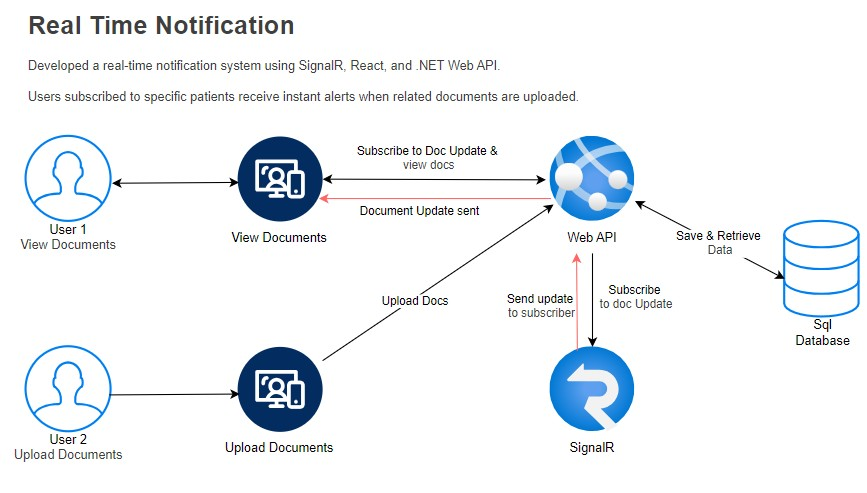

# 🟢 Real-Time Patient Document Notification System

This proof-of-concept project demonstrates a real-time document update notification system built using **React**, **.NET 8 Web API**, **SignalR**, and **SQL Server**.

## 📌 Use Case
Healthcare users (e.g., doctors or staff) can subscribe to specific patients. When another user uploads a document for that patient, only the subscribed user receives a real-time notification — no page refresh needed.

## 🔧 Tech Stack
- 💻 **Frontend**: React, SignalR client
- ⚙️ **Backend**: .NET 8 Web API + SignalR Hub
- 💾 **Database**: SQL Server
- 🔁 **Realtime**: SignalR group-based messaging

## 🚀 How It Works
- User A views patient documents and subscribes to updates
- User B uploads a document for the same patient
- The system triggers an update through Web API → SignalR → User A receives the update in real-time

## 📂 Folder Structure
- `/client`: React frontend (document viewer + SignalR setup)
- `/server`: ASP.NET Core Web API with SignalR Hub

## 📍 Diagram

---

> ⚠️ This is a demo POC. Can be extended to include auth, secure messaging, user roles, and more.

## 👨‍💻 Author
Vinit Kumar — Lead Software Engineer | Cloud Native App Architect
